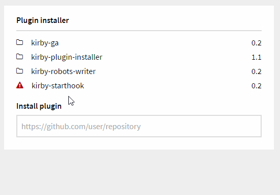

# Kirby Plugin Installer

*Version 0.1*

**WARNING:** By using actions to change your plugins, you risk to break your site or the Panel. To restrict the widget to a username, see [options](#options).



**Features**

- **Install**, **update**, **delete** and **deactivate** plugins.
- Everything is done with the widget.
- Visit plugin Github repository link.
- It will warn if the file does not match the folder, or the plugin type is wrong.
- Possible to restrict permission to only super admin users.

**[Installation instructions](docs/install.md)**

## Usage

1. Go to the Kirby `/panel/`.
1. Look for the Plugin installer widget.
1. Click on a plugin name to do something.   

## Options

The following options can be set in your `/site/config/config.php` file:

```php
c::set('plugin.installer.username', '');
c::set('plugin.installer.panel.uri', 'panel');
```

### `plugin.installer.username`

If you don't want every user to have access to the plugin installer, you can add a username as a `string`, or add multiple usernames as an `array`.

### `plugin.installer.panel.uri`

If you don't use the default panel uri `panel` you, need to change this value.

## Changelog

**0.1**

- Initial release 

## Requirements

- [**Kirby**](https://getkirby.com/) 2.4.1+
- [cURL extension](https://curl.haxx.se/)

## Disclaimer

This plugin is provided "as is" with no guarantee. Use it at your own risk and always test it yourself before using it in a production environment. If you find any issues, please [create a new issue](https://github.com/jenstornell/kirby-plugin-installer/issues/new).

## License

[MIT](https://opensource.org/licenses/MIT)

It is discouraged to use this plugin in any project that promotes racism, sexism, homophobia, animal abuse, violence or any other form of hate speech.

## Credits

- [Jens Törnell](https://github.com/jenstornell)
- [1n3JgKl9pQ6cUMrW](https://github.com/1n3JgKl9pQ6cUMrW) - This plugin was inspired by [Kirby - Plugins Widget](https://github.com/1n3JgKl9pQ6cUMrW/kirby-plugins-widget)